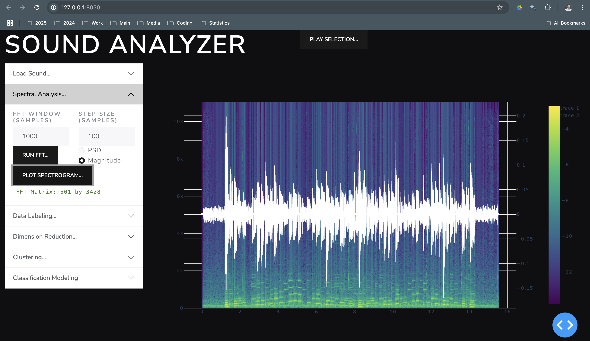

# soundanalyzer

An application for training machine learning models for recognizing music

App capability

* spectral analysis of sound (stft)
* labeling of sound through UI
* dimension reduction of spectral data
* clustering of sounds based on harmonic similarity
* playing sound data selections
* training classification models for labels applied manually
* reviewing classification model predictions

## Environment

Install required packages.

```
pip install -r requirements.txt
```

## Run App

First, add wav files to `soudns` directory. then run app.

```
python3 app.py
```

## Usage Steps


### Load Sound

* choose file from dropdown list. Click load sound.


### Perform spectral analysis: 

* Choose parameters and click run FFT. click plot spectrogram to show result. window size and hop size are specified in samples. option to use power spectral density or magnitude directly from the fourier transform.



### Perform manual data labelling: 

* Select regions of the timeseries, types a data label, and click store event. Events are stored in a json file one level up from the execution directory. Click play selection to play the area selected on the graph.


### Spectral Dimension Reduction

* Choose the number of principal dimensions and click Run PCA. Option to whiten (equalize variance of components, could be beneficial for clustering downstream). 

View the results as

* principal spectra plot (click show components)
* matrix plot (all possible pairs of PC's as 2D scatter plots)
* 3d embedding plot (3D scatter plot of any 3 dimensions)
* pc time series (spectrogram with principal component values overlayed)


### Principal Spectra

Sound embedding dimensions correspond to spectra. Click each principal spectra to play it. They all sound like noise and are difficult to distinguish. They somehow provide emough information to the ML model to identify chords. Each principal spectrum shown here is the spectrum resulting from the mean spectrum plus one unit of each principal component.


### Clustering

perform agglomerative clustering on the spectra to break time series into sound groups based on similarity. choose number of clusters and the number of principal components to skip. Excluding first principal dimension from the clustering makes clustering less sensitive to overall loudness. click perform clustering. clustering results can be viewed on the spectrogram timeseries or the 3d embedding plot.


### 3D embedding plot with clustering

Each spectrum is represented as a point in a low dimensional embedding space vis PCA. The spectra themselves have dimension `w / 2 + 1` where `w` is the FFT window width, typically 1000. Each spectrum contains a combination of each basis dimension. The amount of each principal spectrum present in each spectrum can be shown in a 3D scatter plot with colors representing the clusters. Clusters typically represent notes or chords or sounds with similar harmonic content. 


### Train Classifier

* Ensure events are entered in the event table


* Click train classifier. One classifier is trained for each label.


* Display predictions (click show predictions)

